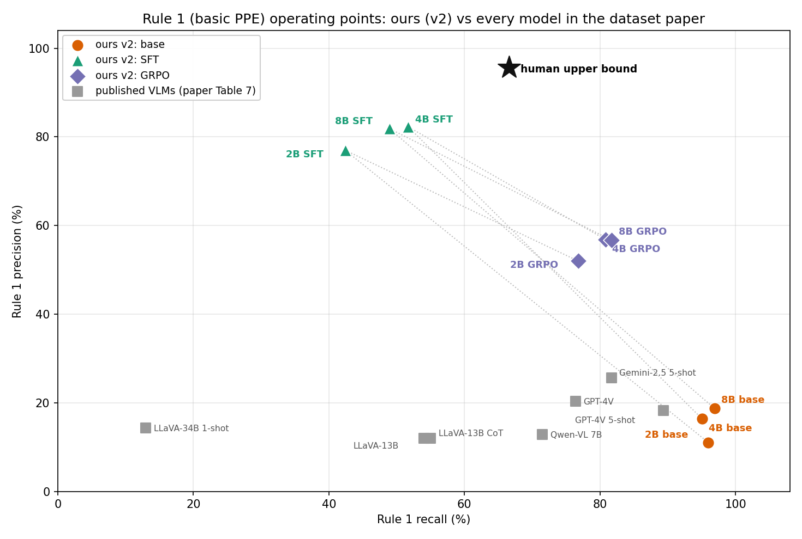
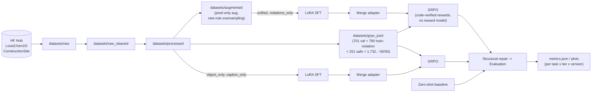

# VLM Safety Reasoning

**Fine-tuning Qwen3-VL for automated construction-site safety inspection — a Mitacs Globalink Research Internship (GRI) project at the University of Calgary.**

This repository trains and evaluates Vision-Language Models that look at a construction-site photograph and report (depending on the pipeline) a scene caption, the presence of key safety-relevant objects, and violations of four site-safety rules — each with a bounding box and a one-sentence justification. The end goal is a model that reasons about *why* a scene is unsafe, not just that it is, in a form that's checkable against the image.

Training is two-phase per model size: **LoRA supervised fine-tuning (SFT) → adapter merge → GRPO** (reinforcement learning with verifiable, code-based rewards — no reward model, no human preference data). Everything runs on the [`LouisChen15/ConstructionSite`](https://huggingface.co/datasets/LouisChen15/ConstructionSite) dataset (6,308 train / 701 val / 3,004 test images) across three model scales — 2B, 4B, and 8B parameter [Qwen3-VL](https://huggingface.co/collections/unsloth/qwen3-vl) checkpoints via [Unsloth](https://github.com/unslothai/unsloth) — on the University of Calgary's ARC HPC cluster (SLURM).

> **For anyone extending this code** (including a future Claude Code session): [`CLAUDE.md`](CLAUDE.md) is the authoritative, exhaustively-detailed engineering reference — config layering, every fixed bug, every safety brake, every invariant. This README is the map; CLAUDE.md is the territory.

---

## Why four pipelines, not one

The central design decision in this repo: instead of one model that does everything, it runs **four independent, parallel pipelines** — same images, same base models, same baseline→SFT→merge→GRPO→eval structure — that differ only in what the model is asked to produce. This turns "does multi-task output help or hurt each sub-task?" into something the repository can actually measure, rather than assume.

| Task | Prefix | Model outputs | Wire format | Capabilities |
|---|:---:|---|---|:---:|
| `unified` | `unified` | caption + 3 object classes + 4 rule violations | fenced JSON | caption, objects, violations |
| `violations_only` | `vo` | 4 rule violations only | fenced JSON | violations |
| `object_only` | `oo` | 3 object classes only, boxes on a `[0, 1000]` grid | fenced JSON | objects |
| `caption_only` | `co` | one scene description | bare prose (no JSON) | caption |

All four can be trained **concurrently on the same cluster, same version tag, same tier**, without colliding — every checkpoint, prediction file, SLURM job, and W&B run is namespaced by task prefix. This "parallel-safety" guarantee is itself a tested invariant (`tests/test_core/test_name_isolation.py`), not just a convention.

**The four safety rules and three tracked object classes** (from the shared prompt, [`data/prompt_templates.py`](data/prompt_templates.py)):

| Rule | Violation |
|---|---|
| Rule 1 — basic PPE | A person on foot is missing a hard hat, or has shoulders/legs uncovered |
| Rule 2 — safety harness | A person working at height (scaffold, roof, beam, ladder) has no harness |
| Rule 3 — edge protection | An open excavation, trench, pit, or floor edge has no guard rail or barrier |
| Rule 4 — blind spot | A person stands in the operating radius / blind spot of an excavator or heavy machine |

| Object class | Notes |
|---|---|
| `excavator` | Any excavator or similar tracked digging machine, including arm and bucket |
| `rebar` | Exposed steel reinforcing bar — not to be confused with pipes, scaffolding, or lumber |
| `worker_with_white_hard_hat` | A worker in a **white** hard hat specifically (yellow/red/blue/orange doesn't count) |

---

## Results (violations_only, v2, all three tiers, full baseline → SFT → GRPO chain)

> **📊 The full v2 results report — with bootstrap confidence intervals, paired significance tests, per-rule
> breakdowns, LLM-judge scores, a direct comparison against every model in the dataset paper's Tables 7 and 8,
> a root-cause analysis and a costed v3 plan — is [`README_v2.md`](README_v2.md).** The summary below is the
> short version. Any older numbers elsewhere in this repo (including `baseline_vs_sft_report.md` and the
> `evaluation_results_archive*` folders) predate v2 and are superseded.

Nine runs, 3,004 test images (411 unsafe = 13.68%, 435 ground-truth rule-instances), commit `4acb833`:

| Violation identification, micro | 2B | 4B | 8B |
|---|---:|---:|---:|
| baseline — flag rate | 93.5% | 64.2% | 59.0% |
| baseline — precision / recall | 0.084 / 0.890 | 0.131 / 0.862 | 0.169 / 0.848 |
| baseline — **F1** | 0.153 | 0.228 | 0.282 |
| SFT — flag rate | 13.3% | 13.9% | 14.8% |
| SFT — precision / recall | 0.463 / 0.444 | 0.526 / 0.529 | 0.478 / 0.513 |
| SFT — **F1** | 0.453 | 0.528 | 0.495 |
| GRPO — flag rate | 20.2% | 18.8% | 21.9% |
| GRPO — precision / recall | 0.464 / 0.658 | 0.524 / 0.699 | 0.466 / 0.731 |
| GRPO — **F1** | **0.544** | **0.599** | **0.569** |



**Reading it honestly.** Zero-shot VLMs fail here by flagging almost everything — 59–94% of images against a
13.7% true rate — so their 85–89% recall is not a detection result. **SFT fixes the calibration** (flag rate
drops to ~14%, precision rises 3–6×, raw JSON validity at 2B goes from 20.1% to 99.9%) and is worth +0.21 to
+0.30 F1 at every tier, *p* < 0.001. **GRPO then buys recall almost for free**: +17 to +22 points of recall for
−1.2 to +0.2 points of precision, *p* < 0.001 at every tier — and at the image-screening level (*"should an
inspector look at this photo?"*) it lifts balanced accuracy from 0.72/0.76/0.75 to 0.80/0.83/0.83.

Three honest caveats, each quantified in [`README_v2.md`](README_v2.md): **macro-F1 is flat** from SFT to GRPO
(*p* = 0.33–0.52) because GRPO reallocates its prediction budget onto rule_1 and suppresses the three rare
rules — a consequence of the reward specifying one global confidence threshold (p\* = 0.298) for four rules
with very different achievable precision; **8B is worse than 4B after fine-tuning** (−0.033 F1, and the LoRA
capacity confound is now ruled out — it is overfitting: 8B's best validation loss arrives at step 125 of 512);
and the **2B baseline row is largely a measurement of the structural-repair script** (79.9% of its raw outputs
are unparseable).

**Versus the literature on the same test split.** Rule 1 precision: our 4B SFT **82.3%** against the best
published VLM's 25.6% and a human upper bound of 95.6%. Rule 1 recall: our 8B GRPO **81.7%**, above the human
upper bound of 66.6%. Violation-grounding IoU beats the best published number on **all four rules**
(45.6 vs 23.1, 41.7 vs 40.1, 43.7 vs 32.6, 48.4 vs 25.8). No published model on this dataset holds high
safe-site accuracy and useful violation recall simultaneously; our 4B SFT does (93.3% rule₀ recall at 51.7%
rule_1 recall).

---

## Architecture at a glance



The four tasks share everything upstream of SFT input (base model, GRPO pool, data prep) and diverge only in prompt, target schema, reward weights, and token budgets — all of which are declared once, in one place per task, and read everywhere else through a small set of registries:

| Concern | Single source of truth |
|---|---|
| Task registration, prefix, capabilities, wire format | [`core/tasks.py`](core/tasks.py) — one `TaskSpec` per task |
| Prompt text | [`data/prompt_templates.py`](data/prompt_templates.py) |
| Output schema / validation | [`data/schemas.py`](data/schemas.py) (Pydantic) |
| SFT target & GRPO ground truth | [`data/preprocessor.py`](data/preprocessor.py) |
| Reward functions & weights | [`configs/tasks/*.yaml`](configs/tasks) + [`rewards/unified_reward.py`](rewards/unified_reward.py) |
| Raw-completion parsing | [`evaluation/output_parser.py`](evaluation/output_parser.py) |
| Structural repair (malformed-output recovery) | [`preprocessing/structural_repair.py`](preprocessing/structural_repair.py) |
| Eval metrics | [`evaluation/evaluator.py`](evaluation/evaluator.py) |
| Every generated name (checkpoints, jobs, results) | [`core/naming.py`](core/naming.py) |

Config itself layers, last-wins: `base.yaml → model_registry.yaml → {sft,grpo}.yaml → tasks/<task>.yaml` ([`core/config.py`](core/config.py)). Adding a fifth task pipeline touches six well-defined places and **zero** orchestration code — see CLAUDE.md's [Adding a new task pipeline](CLAUDE.md#adding-a-new-task-pipeline).

---

## The research problem: reward hacking in verifiable rewards

GRPO here trains against code-computed rewards (format validity, grounding IoU, violation F1, text-similarity), which is cheap and reproducible but opens the door to a model exploiting the letter of the reward function rather than the intent behind it. A meaningful share of this project's engineering effort went into **finding and closing these exploits before they could be trained into a policy**, verified with a standing regression tool (`scripts/validate_rewards.py`) that scores synthetic honest vs. degenerate policies against real ground truth and fails the build if any degenerate policy wins:

- **Reflexive violation-flagging vs. honest abstention** — at a flat true-negative constant, always asserting the most common rule beat honestly saying "safe" by 5×. Closed with a per-task-tuned constant, verified against the measured 50/50 violation/safe GRPO pool composition.
- **Suppressing rare object classes** — flat constants made the break-even IoU for rare classes exceed 1.0, i.e. mathematically unreachable, making "never predict this class" strictly dominant. Closed with per-class constants tuned against real class prevalence.
- **Contentless violation assertions** (`{"reason": "", "bounding_box": []}`) — closed by requiring genuine substance (a real reason or a real box) for true-positive credit, while a bare assertion still counts as a false alarm on a safe image. Net effect: a contentless assertion scores as a miss on a real violation *and* a false alarm on a safe one — never a win.
- **A parse/schema failure and a genuinely-wrong-but-valid answer are indistinguishable in the reward signal** (both score exactly `0.0`) — a known, currently-open limitation, actively monitored via `frac_reward_zero_std` rather than papered over.

CLAUDE.md documents the exact math behind each fix (break-even IoUs, expected-value tables, the GRPO learning-rate derivation) — this is the part of the project most worth reading closely if you're auditing the RL setup.

---

## Repository layout

```
core/            Task registry, config loader, naming, run manifests — the spine every other module imports
data/            Dataset loading, preprocessing, prompts, schemas, augmentation, GRPO pool construction
rewards/         GRPO reward functions (format, grounding, violation ID, violation grounding, captioning, reasoning)
models/          Model loading (Unsloth), SFT trainer, GRPO trainer, inference
evaluation/      Structural / grounding / violation / captioning / reasoning metrics + the evaluator entrypoint
preprocessing/   Post-inference structural repair (recovers malformed-but-salvageable model outputs)
experiments/     Entry points: run_sft.py, run_grpo.py, run_inference.py, run_evaluation.py, results tooling
scripts/         SLURM phase scripts (hpc_*.sh), pipeline submitters, the reward validator, data-prep drivers
configs/         base.yaml, model_registry.yaml, sft.yaml, grpo.yaml, and configs/tasks/<task>.yaml
tests/           576 tests, no GPU required — task registry, name isolation, rewards, preprocessing, evaluation
notebooks/       Exploratory analysis notebooks (dataset exploration, validation, baseline/SFT inspection)
```

Everything under `core/`, `data/schemas.py`, and `rewards/` runs on a plain CPU/Windows dev box. Everything that imports `unsloth` (`experiments/run_{sft,grpo,inference}.py`, `merge_sft_adapter.py`, every `scripts/hpc_*.sh`) is HPC-only.

---

## Getting started

**Local (dev box, CPU-only — tests, config validation, reward-surface checks):**

```powershell
python -m venv venv
.\venv\Scripts\Activate.ps1
pip install -r requirements.txt
```

**HPC (ARC / SLURM — the four `hpc_*.sh` phase scripts, `unsloth`-dependent code):**

```bash
bash scripts/setup_arc.sh   # once, from the login node — clones, loads modules, pins exact versions
module load gcc/13.3.0 python/3.12.5
source $HOME/envs/vlm_grpo/bin/activate
```

**The commands you'll actually run, in order:**

```bash
# 1. Data prep (once; HPC for augmentation, either environment for the GRPO pool)
sbatch scripts/augment_data.sh          # -> datasets/augmented, for unified & violations_only SFT
python data/build_grpo_pool.py          # -> datasets/grpo_pool, shared by all four tasks' GRPO phase

# 2. Pre-flight, local, no GPU
python -m pytest tests/ -v                    # 576 tests
python scripts/validate_rewards.py            # reward-surface sanity check, all four tasks

# 3. Submit a full pipeline (repeat per task; any subset of tasks/tiers is safe concurrently,
#    baseline runs independently while sft -> merge -> grpo chain via SLURM afterok dependencies)
python scripts/submit_pipeline.py --task violations_only --tiers 2b 4b 8b --version v1

# 4. Or drive one stage by hand, e.g. inference from an existing SFT checkpoint
python -m experiments.run_inference --tier 8b --variant vo-sft-8b-v1 --checkpoint best --task violations_only

# 5. Pull results together and compare
python -m experiments.build_results_index --tasks violations_only --tiers 2b 4b 8b
python -m experiments.compare_all --index results_index/index.json --out results_index/
```

The submitters degrade gracefully on Windows (no `sbatch` on the box) — they print the exact commands they would submit instead, which doubles as a fast way to eyeball that two task pipelines' generated paths never collide.

See [CLAUDE.md § Commands](CLAUDE.md#commands) for the full command reference — every environment variable, GPU-partition, and walltime detail that actually matters on the cluster.

---

## Testing

```powershell
python -m pytest tests/ -v
```

576 tests, no GPU required, spread across six suites:

| Suite | Tests | Covers |
|---|---:|---|
| `test_core` | 207 | Task registry, config merging, naming/versioning, parallel-safety, pre-flight blocker fixes |
| `test_rewards` | 136 | Every reward component, per-task weighting, reward-hacking regression guards |
| `test_evaluation` | 81 | Metric families, output parsing, capability gating |
| `test_grpo` | 79 | GRPO config assembly, dataset/prompt construction, the `image`-column contract |
| `test_data` | 51 | Schemas, target/ground-truth builders, augmentation, GRPO pool construction |
| `test_preprocessing` | 22 | Structural repair transforms, per-capability gating |

Run with `python -m pytest`, not a bare `pytest` — `tests/` ships with no `__init__.py`, so first-party imports only resolve once the repo root is on `sys.path`, which the `-m` form guarantees locally (the HPC SBATCH scripts export `PYTHONPATH` instead, so bare `pytest` works there).

---

## Status & scope

This is an active research codebase, not a packaged library — three model tiers × four tasks × three pipeline phases is a large experiment surface, and different cells of that grid are at different levels of completion at any given time (see CLAUDE.md's ghost-variable table for a fully transparent log of bugs found and fixed along the way, several of which silently changed what was actually training for a period). The `violations_only` 8B chain shown above is the most complete measured cell; treat other tasks/tiers as in-progress unless CLAUDE.md or a results file says otherwise.

## Acknowledgments

Developed by **Nabeel Shan** during a Mitacs Globalink Research Internship (GRI) at the University of Calgary, with training and evaluation run on the University's **ARC** research computing cluster. Base models: [Qwen3-VL](https://huggingface.co/collections/unsloth/qwen3-vl) (Alibaba Qwen team) via [Unsloth](https://github.com/unslothai/unsloth). Training via [TRL](https://github.com/huggingface/trl) (GRPO) and [PEFT](https://github.com/huggingface/peft) (LoRA). Dataset: [`LouisChen15/ConstructionSite`](https://huggingface.co/datasets/LouisChen15/ConstructionSite).

## License

[MIT](LICENSE)
