# v2 Results Report — `violations_only`

**Fine-tuning Qwen3-VL (2B / 4B / 8B) for construction-site safety-rule violation detection, grounding and
reasoning.** Mitacs Globalink Research Internship, University of Calgary. Dataset:
[`LouisChen15/ConstructionSite`](https://huggingface.co/datasets/LouisChen15/ConstructionSite).

This document reports the **v2** run of the `violations_only` pipeline: 9 runs (3 model sizes × {zero-shot
baseline, LoRA SFT, GRPO}), all evaluated on the same **3,004-image test split** the dataset paper uses, with
bootstrap confidence intervals, paired significance tests, and a direct comparison against every model
published in the dataset paper's Tables 7 and 8.

| | |
|---|---|
| Runs | 9 (`vo-{baseline,sft,grpo}-{2b,4b,8b}-v2`) |
| SLURM jobs | `48501340–43` (2B), `48521185–88` (4B, resubmitted after a node failure), `48501348–51` (8B) |
| Git commit for every run | `4acb833` |
| Test split | 3,004 images · 411 unsafe (13.68%) · 435 rule-instances · rule_1 323, rule_2 25, rule_3 63, rule_4 24 |
| Judge | Llama-3-8B-Instruct, beams 5, seed 20, rubric `28297153fe9d`, **0 unparsed replies in all 9 runs** |
| GPU cost | ≈ 37 H100-hours end to end |
| Statistics | paired bootstrap, B = 2,000–4,000, resampling images |

> Setup, architecture and engineering reference: [`README.md`](README.md) and [`CLAUDE.md`](CLAUDE.md).
> v1 results are superseded by this document — see [§9](#9-v1--v2-every-fix-paid-off).

---

## Contents

1. [Headline result](#1-headline-result)
2. [What the model is asked to do](#2-what-the-model-is-asked-to-do)
3. [Rule-instance detection, with confidence intervals](#3-rule-instance-detection-with-confidence-intervals)
4. [Image-level screening — the deployment metric](#4-image-level-screening--the-deployment-metric)
5. [Comparison with the dataset paper (Table 7)](#5-comparison-with-the-dataset-paper-table-7)
6. [Grounding and reasoning vs the paper (Table 8)](#6-grounding-and-reasoning-vs-the-paper-table-8)
7. [Per-rule breakdown, and what GRPO actually did](#7-per-rule-breakdown-and-what-grpo-actually-did)
8. [Reasoning quality: text similarity and the LLM judge](#8-reasoning-quality-text-similarity-and-the-llm-judge)
9. [v1 → v2: every fix paid off](#9-v1--v2-every-fix-paid-off)
10. [Training diagnostics](#10-training-diagnostics)
11. [Honesty section: what these numbers do *not* mean](#11-honesty-section-what-these-numbers-do-not-mean)
12. [Root-cause analysis](#12-root-cause-analysis)
13. [v3 plan, costed and prioritised](#13-v3-plan-costed-and-prioritised)
14. [Configuration of record](#14-configuration-of-record)
15. [Reproducing this report](#15-reproducing-this-report)

---

## 1. Headline result

**Zero-shot VLMs cannot do this task — not because they miss violations, but because they flag almost
everything.** The 2B baseline flags 93.5% of the 3,004 test images as unsafe against a true rate of 13.7%; the
8B baseline flags 59.0%. Their recall looks excellent (85–89%) and means nothing. This reproduces exactly the
failure mode the dataset paper documents across all seven of its zero-shot VLMs (rule_1 precision 12–26%).

**SFT fixes the calibration. GRPO then buys recall almost for free.**

| tier | phase | flags | precision | recall | **F1 (micro)** | F1 (macro) |
|---|---|---:|---:|---:|---:|---:|
| 4B | baseline | 64.2% | 0.131 | 0.862 | 0.228 | 0.176 |
| 4B | SFT | 13.9% | 0.526 | 0.529 | 0.528 | 0.436 |
| 4B | **GRPO** | 18.8% | 0.524 | **0.699** | **0.599** | **0.445** |

At 4B, GRPO adds **+17.0 points of recall for −0.2 points of precision**. The same shape holds at 2B (+21.4
recall, +0.2 precision) and 8B (+21.8 recall, −1.2 precision), and a paired bootstrap confirms it is not a
trade at all: **the recall gain is significant at *p* < 0.001 at every tier while the precision change is
statistically indistinguishable from zero** (its 95% CI contains 0 at all three tiers). All three SFT→GRPO
F1-micro gains are significant at *p* < 0.001 — in v1 the same comparison gave *p* = 0.08 and *p* = 0.16.


**Against the literature on the same test split and the same rule:** our 4B SFT reaches **82.3% rule_1
precision** where the best published VLM reaches 25.6% and the human upper bound is 95.6%; our 8B GRPO reaches
**81.7% rule_1 recall**, above the human upper bound of 66.6%, at 3× the precision of any published model at
comparable recall. Our violation-grounding IoU beats the best published number on **all four rules**.

**Where it is still weak:** macro-F1 is flat from SFT to GRPO (*p* = 0.33–0.52) because GRPO reallocates its
prediction budget onto rule_1 and suppresses the three rare rules; the 8B tier is *worse* than 4B after
fine-tuning; and an oracle that could simply pick the correct flags out of what our models already emit would
score F1 = 0.83–0.86 against the 0.60 we realise — so the binding constraint is now **decision calibration,
not perception**.

---

## 2. What the model is asked to do

One image in, one fenced JSON object out, judged against four rules:

| Rule | Violation | GT positives in test |
|---|---|---:|
| Rule 1 — basic PPE | a person on foot is missing a hard hat, or has shoulders/legs uncovered | 323 (10.75%) |
| Rule 2 — safety harness | a person working at height has no harness | 25 (0.83%) |
| Rule 3 — edge protection | an open excavation / trench / floor edge has no guard rail | 63 (2.10%) |
| Rule 4 — blind spot | a person stands in an excavator's operating radius / blind spot | 24 (0.80%) |

```json
{"rule_1_violation":{"bounding_box":[[xmin,ymin,xmax,ymax]],"reason":"..."},
 "rule_2_violation":null,"rule_3_violation":null,"rule_4_violation":null}
```

Each violated rule needs **a box** (0–1000 grid, one per offending person/edge/machine) and **a one-sentence
reason naming who is at fault and why**. `null` is the only safe signal. So a single output is scored on three
axes at once: multi-label identification, visual grounding, and natural-language reasoning.

**Pipeline per tier:** zero-shot baseline ‖ (LoRA SFT on 8,198 rule-balanced augmented images → merge the
adapter into the base weights → GRPO on a 1,732-image 50/50 pool with four code-based verifiable rewards).
Inference is greedy (`do_sample=False`), identical prompt and decoding settings in all nine runs. Every run is
inference → **structural repair** → evaluation.

---

## 3. Rule-instance detection, with confidence intervals

Micro = pooled over the 435 ground-truth rule-instances; macro = unweighted mean of the four per-rule F1s.
`F2` is the recall-weighted score the GRPO reward actually optimises. CIs are 95% percentile bootstrap over
images (B = 2,000).

| tier | phase | flag rate | P micro | R micro | **F1 micro [95% CI]** | **F1 macro [95% CI]** | F2 micro |
|---|---|---:|---:|---:|---|---|---:|
| 2B | baseline | 93.51% | 0.0836 | 0.8897 | 0.1529 [0.139, 0.166] | 0.1265 [0.104, 0.151] | 0.3039 |
| 2B | SFT | 13.28% | 0.4628 | 0.4437 | 0.4531 [0.410, 0.493] | 0.3665 [0.314, 0.416] | 0.4474 |
| 2B | GRPO | 20.17% | 0.4643 | 0.6575 | 0.5442 [0.508, 0.582] | 0.3654 [0.307, 0.424] | 0.6070 |
| 4B | baseline | 64.21% | 0.1310 | 0.8621 | 0.2275 [0.209, 0.247] | 0.1762 [0.145, 0.207] | 0.4074 |
| 4B | SFT | 13.88% | 0.5263 | 0.5287 | 0.5275 [0.486, 0.566] | 0.4362 [0.381, 0.487] | 0.5282 |
| 4B | **GRPO** | 18.81% | 0.5241 | 0.6989 | **0.5990 [0.563, 0.634]** | **0.4452 [0.381, 0.504]** | **0.6552** |
| 8B | baseline | 58.95% | 0.1687 | 0.8483 | 0.2815 [0.259, 0.303] | 0.2190 [0.185, 0.253] | 0.4698 |
| 8B | SFT | 14.75% | 0.4775 | 0.5126 | 0.4945 [0.456, 0.535] | 0.4024 [0.351, 0.451] | 0.5052 |
| 8B | GRPO | 21.94% | 0.4656 | 0.7310 | 0.5689 [0.535, 0.603] | 0.4099 [0.356, 0.462] | 0.6562 |

### Paired significance (same resampled image sets for both runs)

| comparison | Δ F1 micro | *p* | Δ F1 macro | *p* |
|---|---:|:--|---:|:--|
| 2B baseline → SFT | **+0.3001** | <0.001 \*\*\* | **+0.2400** | <0.001 \*\*\* |
| 2B SFT → GRPO | **+0.0912** | <0.001 \*\*\* | −0.0011 | 0.517 ns |
| 4B baseline → SFT | **+0.3000** | <0.001 \*\*\* | **+0.2600** | <0.001 \*\*\* |
| 4B SFT → GRPO | **+0.0715** | <0.001 \*\*\* | +0.0089 | 0.387 ns |
| 8B baseline → SFT | **+0.2130** | <0.001 \*\*\* | **+0.1833** | <0.001 \*\*\* |
| 8B SFT → GRPO | **+0.0744** | <0.001 \*\*\* | +0.0075 | 0.327 ns |
| 2B → 4B (baseline) | **+0.0746** | <0.001 \*\*\* | **+0.0498** | <0.001 \*\*\* |
| 4B → 8B (baseline) | **+0.0540** | <0.001 \*\*\* | **+0.0428** | 0.007 \*\* |
| 2B → 4B (SFT) | **+0.0745** | <0.001 \*\*\* | **+0.0698** | 0.001 \*\*\* |
| **4B → 8B (SFT)** | **−0.0331** | 0.967 ns | **−0.0339** | 0.957 ns |
| 2B → 4B (GRPO) | **+0.0548** | 0.001 \*\*\* | **+0.0798** | 0.008 \*\* |
| **4B → 8B (GRPO)** | **−0.0301** | 0.983 ns | −0.0353 | 0.877 ns |

*p* is one-sided: the fraction of bootstrap resamples in which the improvement did **not** hold.

**The SFT → GRPO trade, tested properly.** Splitting F1 into its parts shows GRPO's recall gain is not paid
for out of precision — the precision change is statistically indistinguishable from zero at all three tiers:

| SFT → GRPO | Δ precision (micro) | *p* | Δ recall (micro) | *p* | Δ F2 (micro) | *p* |
|---|---|:--|---|:--|---|:--|
| 2B | +0.0015 [−0.039, +0.040] | 0.480 **ns** | **+0.2138** [+0.163, +0.263] | <0.001 \*\*\* | **+0.1596** | <0.001 \*\*\* |
| 4B | −0.0022 [−0.040, +0.035] | 0.550 **ns** | **+0.1701** [+0.125, +0.217] | <0.001 \*\*\* | **+0.1269** | <0.001 \*\*\* |
| 8B | −0.0119 [−0.044, +0.022] | 0.768 **ns** | **+0.2184** [+0.174, +0.263] | <0.001 \*\*\* | **+0.1510** | <0.001 \*\*\* |

**Three facts fall out of this table.**
1. SFT is the load-bearing stage (+0.21 to +0.30 F1, always).
2. GRPO now works at every tier on micro-F1 — the single most important v2 outcome.
3. **Scale helps the pretrained model and stops helping after fine-tuning.** 4B→8B is positive and significant
   for the baseline (+0.054) and *negative* for both trained phases. v1 raised the hypothesis that this was a
   LoRA-capacity artifact (8B was adapted at 0.58% of parameters vs 2B's 1.10%); v2 re-levelled the ranks to
   16/20/32, verified at runtime as **1.10% / 1.10% / 1.16% trained**, and the 4B→8B deficit survived. That
   hypothesis is dead; see [§12.4](#124-why-8b--4b-after-fine-tuning).

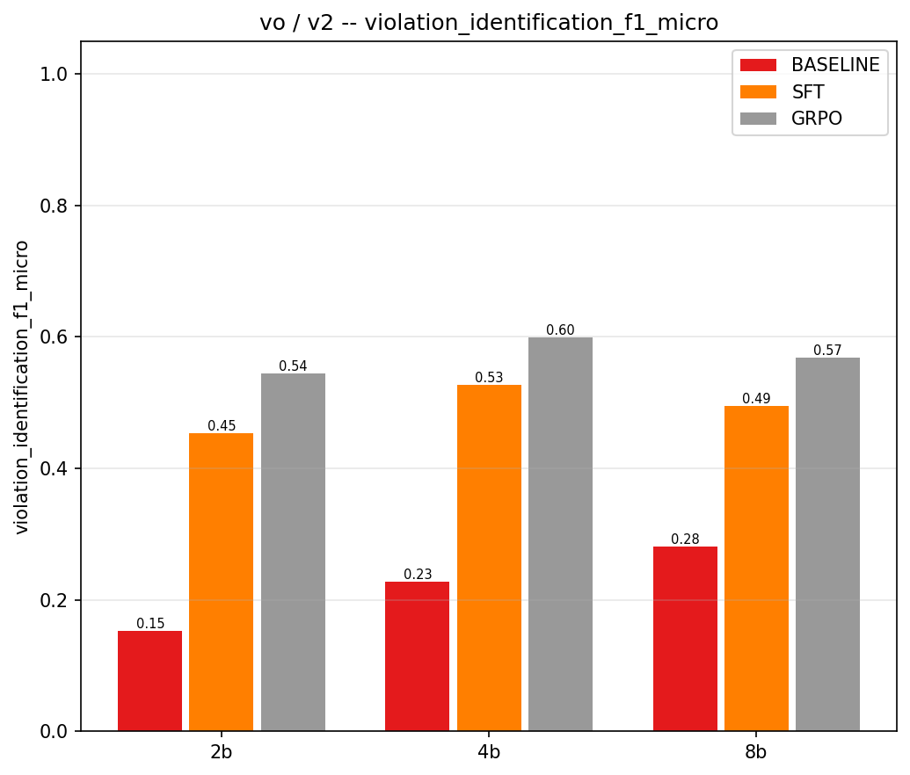
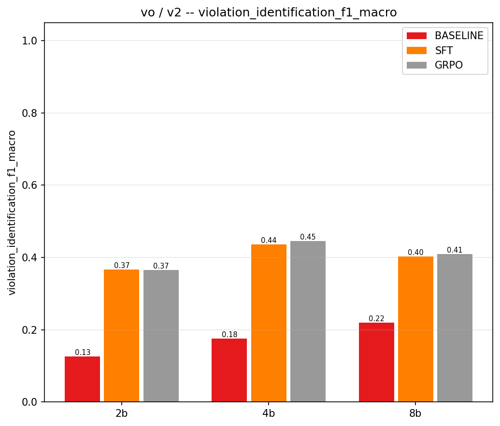

---

## 4. Image-level screening — the deployment metric

Rule-instance F1 is the paper-comparable number, but the question a site-safety tool is actually asked is
*"should a human look at this photo?"* Collapsing the four rules to one binary decision per image:

| tier | phase | flags | precision | recall | F1 | false-alarm rate | balanced accuracy |
|---|---|---:|---:|---:|---:|---:|---:|
| 2B | baseline | 93.5% | 0.140 | 0.954 | 0.244 | 93.2% | 0.511 |
| 2B | SFT | 13.3% | 0.524 | 0.509 | 0.516 | 7.3% | 0.718 |
| 2B | GRPO | 20.2% | 0.485 | 0.715 | 0.578 | 12.0% | 0.798 |
| 4B | baseline | 64.2% | 0.201 | 0.944 | 0.332 | 59.4% | 0.675 |
| 4B | SFT | 13.9% | 0.585 | 0.594 | 0.589 | 6.7% | 0.764 |
| 4B | **GRPO** | 18.8% | 0.552 | 0.759 | **0.639** | 9.8% | 0.831 |
| 8B | baseline | 59.0% | 0.220 | 0.949 | 0.358 | 53.3% | 0.708 |
| 8B | SFT | 14.8% | 0.535 | 0.577 | 0.555 | 7.9% | 0.749 |
| 8B | GRPO | 21.9% | 0.496 | 0.796 | 0.611 | 12.8% | **0.834** |

Paired tests, SFT → GRPO: balanced accuracy **+0.080 / +0.067 / +0.085**, all *p* < 0.001; image-F1 **+0.062 /
+0.050 / +0.056**, all *p* ≤ 0.003; false-alarm rate +4.7 / +3.1 / +4.9 points, all *p* < 0.001.

**This is the cleanest statement of what GRPO bought: +20 points of unsafe-image recall for +3–5 points of
false alarms.** For a triage tool in front of a human inspector that is an unambiguously good trade, and it is
the one place where every tier and every phase orders the way it should.

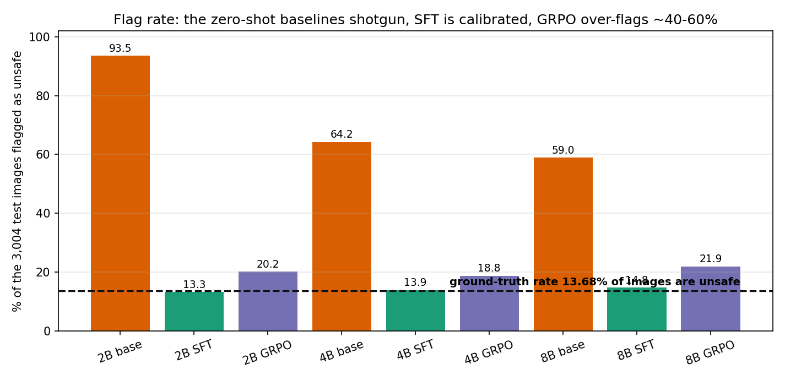

---

## 5. Comparison with the dataset paper (Table 7)

Identical test split and identical rule definitions — the paper's rule_1/2/3/4 positive counts
(323 / 25 / 63 / 24) match ours exactly, so this is a direct comparison. Precision / recall, percent.

| model | rule 0 (safe) | rule 1 | rule 2 | rule 3 | rule 4 |
|---|---|---|---|---|---|
| GPT-4V | 97.0 / 24.6 | 20.4 / 76.4 | 2.7 / 85.7 | 5.3 / 87.7 | 3.7 / 84.0 |
| GPT-4V 5-shot | 98.9 / 32.0 | 18.2 / 89.4 | 5.4 / 85.7 | 4.3 / 89.2 | 4.4 / 68.0 |
| Gemini-2.5 5-shot | 97.5 / 62.1 | 25.6 / 81.7 | 8.8 / 76.0 | 7.0 / 39.7 | 5.0 / 70.8 |
| LLaVA-13B | 88.0 / 43.4 | 12.0 / 54.0 | 1.0 / 42.9 | 2.2 / 33.8 | 0.9 / 44.0 |
| LLaVA-34B 1-shot | 87.1 / 88.7 | 14.3 / 13.0 | 3.0 / 33.3 | 4.5 / 21.5 | 5.2 / 20.0 |
| Qwen-VL 7B | 91.2 / 42.3 | 12.9 / 71.5 | 2.3 / 48.0 | 3.4 / 39.7 | 1.7 / 54.2 |
| *paper average (7 VLMs)* | *93.0 / 48.2* | *16.5 / 63.0* | *3.7 / 60.5* | *4.7 / 47.1* | *3.3 / 53.3* |
| **Human upper bound** | **95.3 / 98.3** | **95.6 / 66.6** | **92.0 / 92.0** | **59.4 / 60.3** | **81.0 / 65.4** |
| | | | | | |
| ours: Qwen3-VL 2B zero-shot | 98.6 / 5.2 | 11.0 / 96.0 | 9.8 / 48.0 | 3.9 / 76.2 | 3.7 / 70.8 |
| ours: Qwen3-VL 4B zero-shot | 98.0 / 40.0 | 16.4 / 95.1 | 14.0 / 32.0 | 6.7 / 68.3 | 5.9 / 70.8 |
| ours: Qwen3-VL 8B zero-shot | 98.3 / 46.7 | 18.7 / 96.9 | 16.9 / 84.0 | 9.3 / 42.9 | 7.9 / 33.3 |
| ours: **4B SFT** | 93.5 / 93.3 | **82.3** / 51.7 | 36.7 / 72.0 | 30.8 / 52.4 | 15.4 / 50.0 |
| ours: **4B GRPO** | 95.9 / 90.2 | 56.9 / **80.8** | **43.8** / 56.0 | **36.7** / 34.9 | **24.1** / 29.2 |
| ours: **8B SFT** | 93.2 / 92.1 | 81.9 / 48.9 | 26.0 / 80.0 | 24.5 / 54.0 | 19.0 / 45.8 |
| ours: **8B GRPO** | 96.4 / 87.2 | 56.7 / **81.7** | 32.7 / 68.0 | 25.4 / 47.6 | 14.9 / 29.2 |

**Reading it.**

- **Our zero-shot baselines land inside the paper's published band** (rule_1 precision 11.0–18.7% vs a paper
  average of 16.5%), which validates the replication: the prompt, the parser and the scoring behave like the
  paper's harness on the same data.
- **Fine-tuning moves precision by a factor of 3–5 over every published model on every rule.** rule_1
  precision 82.3% (paper best 25.6%, human 95.6%); rule_2 43.8% (paper best 8.8%); rule_3 36.7% (paper best
  7.0%); rule_4 24.1% (paper best 5.2%).
- **rule_0 is where the difference is starkest.** Every published VLM that achieves decent violation recall
  has rule_0 recall of 24–62% — i.e. it false-alarms on a third to three-quarters of safe sites. LLaVA-34B
  reaches 88.7% rule_0 recall only by giving up entirely (rule_1 recall 13%). Our 4B SFT holds **93.3% rule_0
  recall with 51.7% rule_1 recall simultaneously**, which no published model on this dataset does.
- **We beat the human upper bound on rule_1 recall** (80.8% and 81.7% vs 66.6%) — consistent with the paper's
  own note that "construction engineers may overlook some dangers … even when violations are obvious."
- **We are still far below humans on the rare rules.** rule_4: ours 24.1/29.2 vs human 81.0/65.4. Both of the
  paper's diagnosed hard rules (2 and 4, which need spatial reasoning about height and proximity) remain hard.

---

## 6. Grounding and reasoning vs the paper (Table 8)

Paper Table 8 columns: violations correctly detected (out of N), average LLM-judge score (0–6), and IoU (%) on
the detected violations. Our IoU is `violation_grounding_mask_iou_rule_N_tn0` — mask-union IoU over the model's
own true positives, the same TP-conditioned construction.

> ⚠️ **"Violations detected" must be read next to precision.** It is a raw true-positive count, so it is
> maximised by flagging everything: our own 2B baseline "detects" 310 of 323 rule_1 violations at 11%
> precision. The column is only meaningful in combination with Table 7 above.

| | rule 1 (of 323) | rule 2 (of 25) | rule 3 (of 63) | rule 4 (of 24) |
|---|---|---|---|---|
| | det / judge / IoU | det / judge / IoU | det / judge / IoU | det / judge / IoU |
| GPT-4V | 246 / 4.5 / 11.9 | 18 / 5.7 / 12.1 | 57 / 5.6 / 30.6 | 21 / 5.7 / 10.0 |
| GPT-4V 5-shot | 288 / 4.7 / 14.0 | 18 / 5.7 / 13.1 | 58 / 5.7 / 32.6 | 17 / 5.9 / 22.5 |
| Gemini-2.5 5-shot | 264 / 5.0 / 3.7 | 19 / 5.7 / 2.5 | 25 / 5.7 / 4.9 | 17 / 5.9 / 9.4 |
| LLaVA-13B | 174 / 2.9 / 20.0 | 9 / 5.0 / 17.9 | 22 / 3.7 / 8.3 | 11 / 4.6 / 21.5 |
| Qwen-VL 7B | 231 / 3.1 / **23.1** | 12 / 5.9 / **40.1** | 25 / 5.1 / 25.0 | 13 / 5.8 / **25.8** |
| *paper average* | *203 / 3.9 / 13.3* | *13 / 5.0 / 16.1* | *30 / 5.1 / 17.0* | *13 / 5.0 / 14.9* |
| **Human upper bound** | **215 / 5.2 / –** | **23 / 5.9 / –** | **38 / 5.8 / –** | **17 / 6.0 / –** |
| | | | | |
| ours 4B SFT | 167 / 4.46 / **44.9** | 18 / 5.39 / 37.3 | 33 / 5.33 / 32.9 | 12 / 5.17 / 41.2 |
| ours 4B GRPO | 261 / 4.17 / **43.6** | 14 / 5.29 / 37.4 | 22 / 5.45 / **43.7** | 7 / 6.00 / **46.6** |
| ours 8B SFT | 158 / 4.59 / **48.5** | 20 / 4.95 / 39.5 | 34 / 5.47 / 31.7 | 11 / 6.00 / 43.4 |
| ours 8B GRPO | 264 / 4.34 / **45.6** | 17 / 5.24 / **41.7** | 30 / 5.27 / 35.5 | 7 / 5.57 / 44.2 |
| ours 2B GRPO | 248 / 3.94 / 41.1 | 18 / 5.11 / 36.9 | 16 / 5.56 / 29.1 | 4 / 6.00 / 48.4 |

**Grounding is our strongest result relative to the literature.** On every rule our TP-conditioned IoU is
above the best published VLM: 45.6 vs 23.1 (rule_1), 41.7 vs 40.1 (rule_2), 43.7 vs 32.6 (rule_3), 48.4 vs
25.8 (rule_4). The paper's own conclusion was "none of the models accurately pinpoint the exact location of
violations"; SFT on 8k in-domain images roughly doubles the best zero-shot IoU. It is still coarse in absolute
terms — a 0.44 IoU box overlaps the right worker but is not tight — and the IoU-conditioned F1 quantifies the
cost: requiring IoU ≥ 0.25 for a true positive drops 4B GRPO's micro-F1 from 0.599 to **0.453**, so roughly a
quarter of our "correct" detections are not localised well enough to show an inspector.

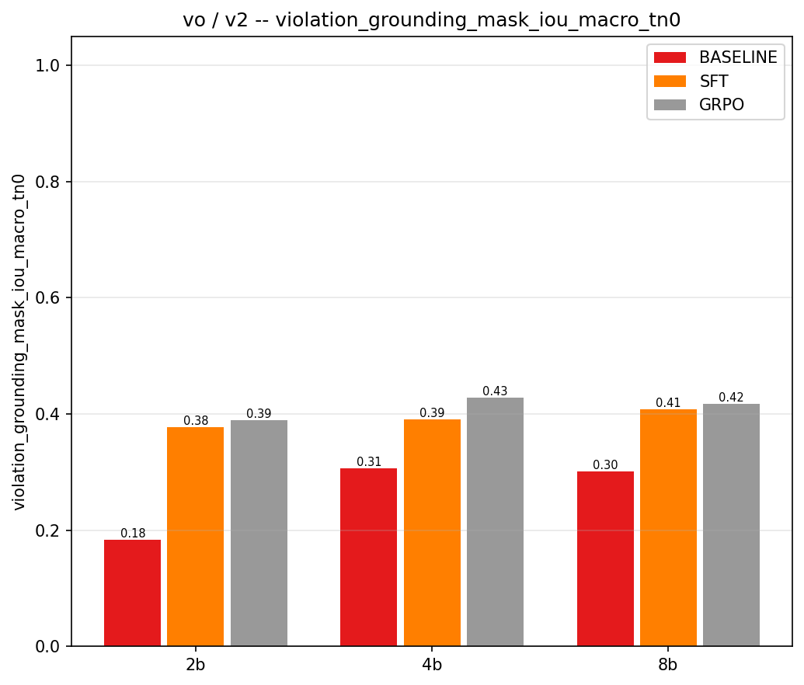

| IoU-conditioned identification (IoU ≥ 0.25 required for a TP) | 2B | 4B | 8B |
|---|---:|---:|---:|
| baseline, micro F1 | 0.0703 | 0.1347 | 0.1327 |
| SFT, micro F1 | 0.2911 | 0.3922 | 0.3769 |
| GRPO, micro F1 | **0.3996** | **0.4532** | **0.4347** |

**The LLM judge places our reasoning between LLaVA-13B and GPT-4V, and short of humans.** Our best rule_1
judge score is 4.59 (8B SFT) against GPT-4V's 4.5, LLaVA-13B's 2.9 and the human upper bound of 5.2. Read
[§8](#8-reasoning-quality-text-similarity-and-the-llm-judge) and [§11.3](#113-the-reasoning-scores-reward-style-not-only-substance)
before quoting that number: 60% of our judged items score a perfect 6/6, and a large part of the gain is
learning the dataset's own phrasing.

---

## 7. Per-rule breakdown, and what GRPO actually did

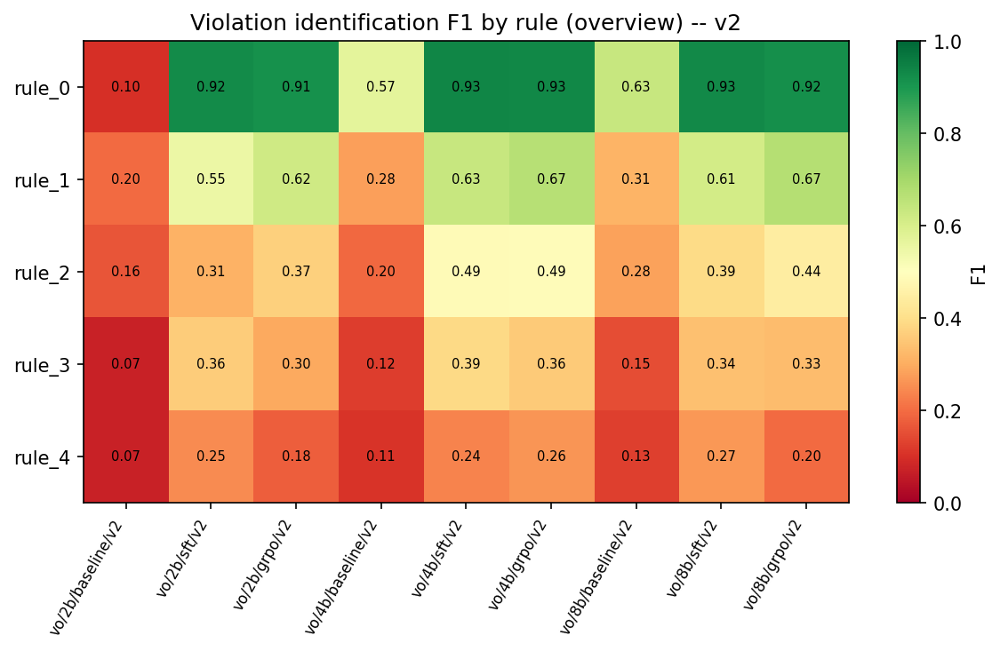

| | rule_1 P/R/F1 | rule_2 P/R/F1 | rule_3 P/R/F1 | rule_4 P/R/F1 |
|---|---|---|---|---|
| 2B SFT | .770/.424/.547 | .202/.680/.312 | .296/.460/.360 | .175/.417/.247 |
| 2B GRPO | .520/.768/.620 | .247/.720/.367 | .356/.254/.296 | .190/.167/.178 |
| 4B SFT | .823/.517/.635 | .367/.720/.487 | .308/.524/.388 | .154/.500/.235 |
| 4B GRPO | .569/.808/.668 | .438/.560/.491 | .367/.349/.358 | .241/.292/.264 |
| 8B SFT | .819/.489/.612 | .260/.800/.392 | .245/.540/.337 | .190/.458/.268 |
| 8B GRPO | .567/.817/.669 | .327/.680/.442 | .254/.476/.332 | .149/.292/.197 |

Paired SFT → GRPO per-rule, bootstrap:

| | rule_1 | rule_2 | rule_3 | rule_4 |
|---|---|---|---|---|
| Δ recall, 2B | **+0.344** \*\*\* | +0.040 ns | **−0.206** | **−0.250** |
| Δ recall, 4B | **+0.291** \*\*\* | **−0.160** | **−0.175** | **−0.208** |
| Δ recall, 8B | **+0.328** \*\*\* | −0.120 | −0.064 | **−0.167** |
| Δ precision, 2B/4B/8B (rule_1) | **−0.250 / −0.254 / −0.252** (CI excludes 0) | — | — | — |
| Δ F1 | +0.073 \*\* / +0.033 ns / +0.057 \* | +0.055 / +0.005 / +0.049 ns | −0.064 / −0.031 / −0.005 ns | −0.069 / +0.029 / −0.071 ns |

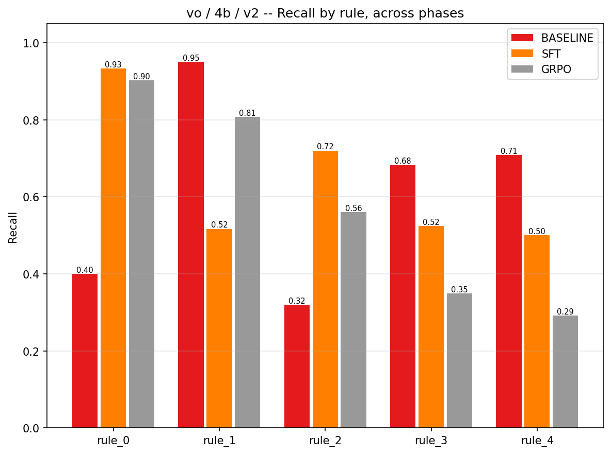
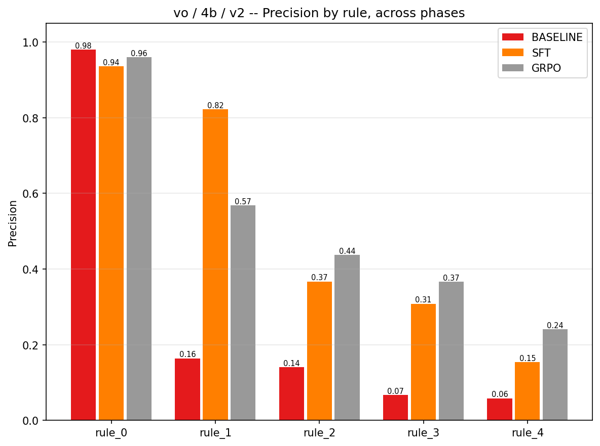

### The marginal analysis — this is the key diagnostic

For every (image, rule) pair, what did GRPO change relative to SFT, and was the change correct?

| tier / rule | flags added | of which correct | **marginal precision** | flags removed | of which correct | marginal precision | net TP | net FP |
|---|---:|---:|---:|---:|---:|---:|---:|---:|
| 2B rule_1 | 300 | 111 | **0.370** | 1 | 0 | 0.000 | +111 | +188 |
| 2B rule_3 | 7 | 2 | 0.286 | 60 | 15 | 0.250 | −13 | −40 |
| 2B rule_4 | 4 | 0 | 0.000 | 40 | 6 | 0.150 | −6 | −30 |
| 4B rule_1 | 257 | 95 | **0.370** | 1 | 1 | 1.000 | +94 | +162 |
| 4B rule_3 | 7 | 1 | 0.143 | 54 | 12 | 0.222 | −11 | −36 |
| 4B rule_4 | 2 | 0 | 0.000 | 51 | 5 | 0.098 | −5 | −44 |
| 8B rule_1 | 273 | 106 | **0.388** | 0 | 0 | — | +106 | +167 |
| 8B rule_3 | 13 | 1 | 0.077 | 34 | 5 | 0.147 | −4 | −17 |
| 8B rule_4 | 9 | 0 | 0.000 | 20 | 4 | 0.200 | −4 | −7 |

**GRPO did not learn to see better. It learned a threshold, and it learned exactly the threshold we asked for.**

The `violations_only` reward pays `violation_tn_constant = 0.30` for a correct abstention and ≈ 0.670 (weighted)
for a correct, grounded, explained detection. The confidence at which flagging becomes worth more than
abstaining is therefore

```
p* = c·(w_id + w_gnd + w_rsn) / [ c·(w_id + w_gnd + w_rsn) + w_id + w_gnd·E[IoU] + w_rsn·E[reason] ]
   = 0.30·0.95 / (0.30·0.95 + 0.422 + 0.317·0.45 + 0.211·0.50)
   = 0.285 / 0.955  =  0.298
```

The measured marginal precision of the rule_1 flags GRPO **added** is 0.370 / 0.370 / 0.388 — just above p*.
The measured marginal precision of the rule_3/rule_4 flags it **removed** is 0.077–0.250 — just below p*.
GRPO converged to the reward's analytic operating point at all three tiers, to within 0.07.

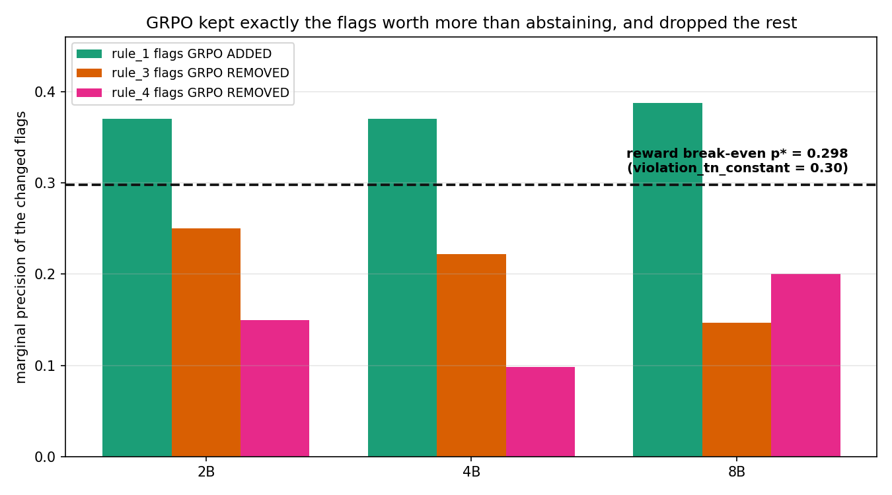

That is an encouraging result about the RL machinery and a clear statement of where the remaining problem
lives: **in the reward's specification of a single global operating point**, not in the optimiser, the model,
or the data.

### Oracle headroom

| tier | SFT F1 micro | GRPO F1 micro | union of both | intersection | **oracle: perfect pick from the union** |
|---|---:|---:|---:|---:|---:|
| 2B | 0.4531 | 0.5442 | 0.5264 | 0.4664 | **0.8306** |
| 4B | 0.5275 | 0.5990 | 0.5729 | 0.5554 | **0.8568** |
| 8B | 0.4945 | 0.5689 | 0.5509 | 0.5134 | **0.8627** |

Between them, SFT and GRPO already *emit* a correct flag for ~71–76% of all ground-truth rule-instances. An
oracle that kept only the correct ones would score F1 ≈ 0.86. We realise 0.60. **The gap is a ranking
problem.** And it cannot be closed with a heuristic: we probed box count, total box area, reason word count,
rules-per-image, and template frequency as post-hoc confidence proxies, and every AUC came back between 0.44
and 0.59 (chance = 0.50), with the best single-feature filter worth at most +0.014 F1. The model currently
exposes **no** usable confidence — v3 has to create one ([§13](#13-v3-plan-costed-and-prioritised)).

---

## 8. Reasoning quality: text similarity and the LLM judge

Both families score only the model's **own true positives**, per the paper's protocol, so each run is scored on
a different image population — the `scored_count` columns are as important as the scores.

| tier/phase | items judged | judge total (macro) | judge total rule_1 | BERTScore F1 micro | METEOR micro | CIDEr-D macro | avg words |
|---|---:|---:|---:|---:|---:|---:|---:|
| 2B baseline | 387 | 3.741 | 3.226 | 0.4713 | 0.1764 | 0.272 | 15.2 |
| 2B SFT | 193 | 5.170 | 4.642 | **0.7545** | 0.3334 | 1.744 | 11.3 |
| 2B GRPO | 286 | 5.152 | 3.936 | 0.7292 | 0.3094 | 1.721 | 10.9 |
| 4B baseline | 375 | 4.736 | 3.840 | 0.4596 | 0.2078 | 0.307 | 18.6 |
| 4B SFT | 230 | 5.088 | 4.461 | 0.7370 | 0.3314 | 1.634 | 11.7 |
| 4B GRPO | 304 | **5.228** | 4.172 | 0.7422 | 0.3262 | 1.689 | 11.1 |
| 8B baseline | 369 | 4.719 | 4.147 | 0.5348 | 0.2332 | 0.324 | 16.6 |
| 8B SFT | 223 | **5.254** | **4.595** | 0.7507 | **0.3402** | 1.736 | 11.6 |
| 8B GRPO | 318 | 5.104 | 4.341 | 0.7483 | 0.3307 | 1.645 | 10.9 |

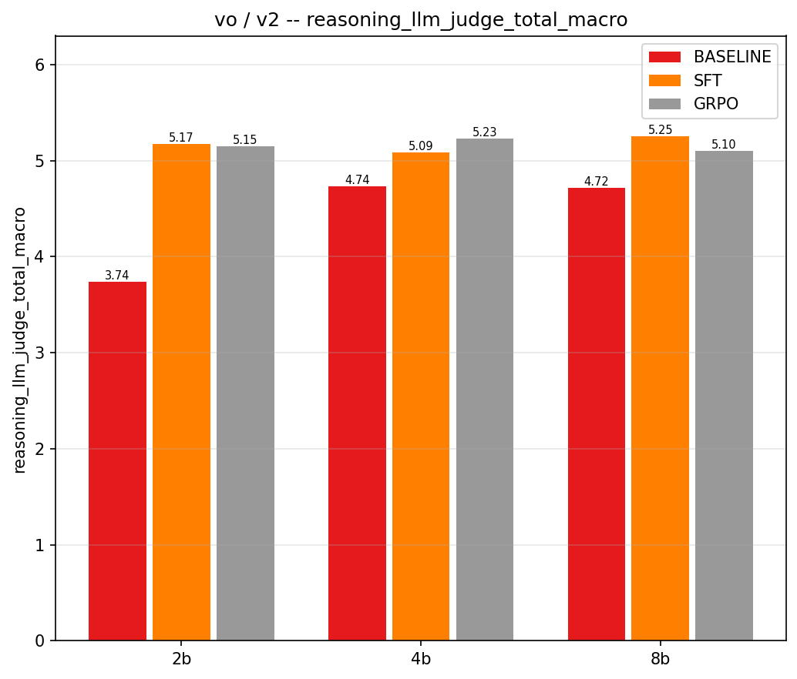

**GRPO looks worse than SFT on every reasoning metric — and that is entirely a population-shift artifact.**
Restricting to the (image, rule) true positives that *both* runs share:

| tier | shared TPs | SFT judge total | GRPO judge total | Δ | candidates byte-identical |
|---|---:|---:|---:|---:|---:|
| 2B | 170 | 4.788 | 4.865 | **+0.076** | 56% |
| 4B | 208 | 4.663 | 4.707 | **+0.043** | 61% |
| 8B | 211 | 4.787 | 4.972 | **+0.185** | 64% |

On identical items GRPO is equal or slightly better, and **56–64% of its explanations are the same string SFT
produced**. GRPO changed *which rules it flags*, not how it writes. Splitting by what changed:

| tier | SFT on shared | SFT-only (GRPO dropped these) | GRPO on shared | **GRPO-only (newly added)** |
|---|---:|---:|---:|---:|
| 2B | 4.788 | 4.826 | 4.865 | **3.052** |
| 4B | 4.663 | 5.000 | 4.707 | **3.604** |
| 8B | 4.787 | 5.583 | 4.972 | **3.579** |

The detections GRPO **added** are explained much worse (3.05–3.60), which is what "marginal detection" means —
harder images, less certain descriptions. Meanwhile the detections it **dropped** were its *best*-explained
ones (4.83–5.58), because they were the templated rare-rule cases. Both effects are honest signal, but they
mean **the micro-averaged reasoning scores cannot be used to compare phases**. Report the matched-subset delta,
or report per-rule scores next to `scored_count`.

**Criterion-level detail (4B).** Relevance is saturated (1.68 → 1.87, max 2) because our output format *tells*
the judge which rule the sentence is about — the model never has to select the rule in prose, unlike the
paper's free-form models. Equivalence and specificity carry all the discriminative power:

| 4B | relevance (0/1/2 counts) | equivalence | specificity |
|---|---|---|---|
| baseline | 38/44/293 → 1.680 | 107/57/211 → 1.277 | 129/83/163 → 1.091 |
| SFT | 7/17/206 → **1.865** | 39/39/152 → **1.491** | 63/26/141 → **1.339** |
| GRPO | 10/44/250 → 1.789 | 79/50/175 → 1.316 | 94/39/171 → 1.253 |

---

## 9. v1 → v2: every fix paid off

v2 changed five things; this table isolates their effect, paired on the same 3,004 images. (v1's runs predate
the per-image outcome vector in `metrics.json`, so v1's vectors were reconstructed locally from its repaired
prediction files with the same parser and the same presence predicate — verified by reproducing all nine v2
numbers exactly by the same route.)

| tier / phase | v1 F1 micro | v2 F1 micro | Δ | *p* | Δ F1 macro | *p* |
|---|---:|---:|---:|:--|---:|:--|
| 2B baseline | 0.1290 | 0.1529 | +0.0239 | <0.001 \*\*\* | +0.0225 | 0.030 \* |
| 2B SFT | 0.2461 | 0.4531 | **+0.2070** | <0.001 \*\*\* | **+0.2323** | <0.001 \*\*\* |
| 2B GRPO | 0.3730 | 0.5442 | **+0.1713** | <0.001 \*\*\* | +0.1035 | 0.002 \*\* |
| 4B baseline | 0.2275 | 0.2275 | **0.0000** | — | 0.0000 | — |
| 4B SFT | 0.4689 | 0.5275 | +0.0586 | 0.001 \*\*\* | +0.0789 | <0.001 \*\*\* |
| 4B GRPO | 0.4869 | 0.5990 | **+0.1121** | <0.001 \*\*\* | +0.0673 | 0.007 \*\* |
| 8B baseline | 0.2883 | 0.2815 | −0.0068 | ns | −0.0045 | ns |
| 8B SFT | 0.4679 | 0.4945 | +0.0266 | 0.059 ns | +0.0715 | 0.001 \*\*\* |
| 8B GRPO | 0.4798 | 0.5689 | **+0.0891** | <0.001 \*\*\* | +0.0725 | 0.002 \*\* |

| change | v1 | v2 | measured effect |
|---|---|---|---|
| **SFT budget & handoff** | `early_stopping_patience` on `eval_loss`; stopped at step 300/375/375; handoff from `best/` (step 200/275/275) | early stopping **off**; full 512 steps; handoff from `final/` | The largest single v2 gain. 2B SFT recall 0.163 → 0.444; F1 micro +0.207. `eval_loss` was ranking noise, exactly as predicted. |
| **`violation_tn_constant`** | 0.85 (break-even p\* = 0.546) | **0.30** (p\* = 0.298) | GRPO went from statistically inert to +0.07–0.09 F1 micro at every tier; recall micro +0.17–0.22. |
| **GRPO LR / schedule** | 2.0e-6, `cosine` (LR ≈ 0 for the last fifth) | **1.0e-5, `constant_with_warmup`** | KL to the reference rose from ≤0.001 to 0.003–0.005 and reward now climbs; the policy actually moves. |
| **Per-tier LoRA rank** | r = 16 everywhere → 1.10 / 0.88 / 0.58% of params trained | **16 / 20 / 32** → 1.10 / 1.10 / 1.16% trained (verified in the logs) | Removed the tier-scale confound. **4B→8B is still negative**, so adapter capacity was not the cause. |
| **Structural repair: list handling** | a LIST value for `rule_N_violation` returned `None`, *inverting* the answer to "not violated" | boxes unioned, reasons de-duplicated and joined | 2B baseline recall 0.469 → 0.890. The v1 2B-baseline row was a repair bug, not a model measurement. |
| **Evaluation: TP-conditioned macros** | unmeasured rules substituted 0.0 and still divided by 4 | skip unmeasured rules, publish `_macro_n_rules` | 8B SFT macro +0.072 \*\*\* with no model change — the v1 number was an averaging artifact. |
| **LLM-as-a-judge** | absent | added, paper-faithful | Puts our reasoning in the paper's Table-8 units for the first time. |

Two useful sanity checks fall out: the **4B baseline reproduced bit-identically** across v1 and v2 (Δ = 0.0000
on every metric), confirming the inference path is deterministic; and the **8B baseline moved by −0.007**,
which is the repair change acting on its 90 list-valued records.

### SFT → GRPO, v1 vs v2

| tier | v1 Δ F1 micro | v2 Δ F1 micro |
|---|---|---|
| 2B | +0.1269 | **+0.0912** \*\*\* |
| 4B | +0.0180 (*p* = 0.08, ns) | **+0.0715** \*\*\* |
| 8B | +0.0119 (*p* = 0.16, ns) | **+0.0744** \*\*\* |

---

## 10. Training diagnostics

### SFT

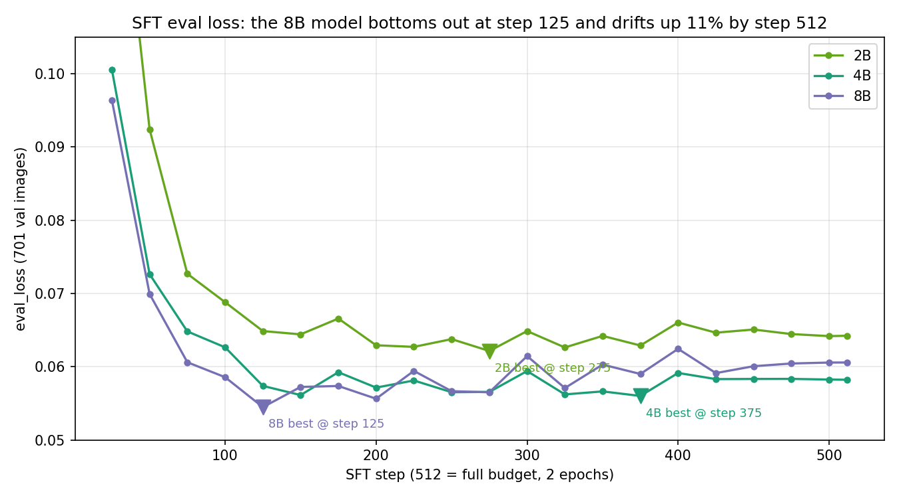

| tier | steps | final train loss | best eval_loss | at step | final eval_loss | drift |
|---|---:|---:|---:|---:|---:|---:|
| 2B | 512 | 0.0635 | 0.06215 | 275 | 0.06423 | +3.3% |
| 4B | 512 | 0.0432 | 0.05601 | 375 | 0.05822 | +3.9% |
| 8B | 512 | 0.0350 | **0.05448** | **125** | 0.06058 | **+11.2%** |

All three reached `global_step = 512` with `status: completed`. Train loss falls 4–8× while eval_loss flattens
then drifts up, and **the drift grows with model size**: the 8B model reaches its best validation loss at step
125 of 512 and spends 75% of the budget getting worse on validation while train loss keeps falling to 0.035.
Its final eval_loss (0.0606) is worse than 4B's (0.0582). `grad_norm` stayed at 0.15–0.47 against
`max_grad_norm = 1.0` — never clipped. Cosine decayed the LR to 1.2e-09 by step 500, so the last ~60 steps did
nothing.

Note that v2's decision to use `final/` was still correct on the metric that matters: 8B SFT's *downstream*
macro-F1 improved by +0.072 (*p* = 0.001) versus v1's early-stopped `best/`, even though its eval_loss is
worse. `eval_loss` remains a bad ranker on this task (86% of the target character mass is the fixed all-null
skeleton) — but the 8B curve is now a big enough, monotone enough drift to be worth testing directly
([§13](#13-v3-plan-costed-and-prioritised), P0-1).

### GRPO

108 steps, 2 epochs over the 1,732-image pool, logged every 5 steps.

| tier | reward first → last (max) | KL mean / max | grad_norm mean (steps above the 0.3 clip) | `frac_reward_zero_std` mean | reward_std first → last | completion length | wall |
|---|---|---|---|---|---|---|---|
| 2B | 0.382 → 0.445 (0.490 @ 40) | 0.0039 / 0.0064 | 0.408 (**17/21**) | 0.405 | 0.110 → 0.081 | 61 → 62 | 5 h 24 m |
| 4B | 0.426 → 0.469 (0.499 @ 70) | 0.0029 / 0.0047 | 0.375 (**19/21**) | 0.455 | 0.116 → 0.053 | 62 → 61 | 9 h 22 m |
| 8B | 0.381 → 0.482 (0.523 @ 40) | 0.0167 / 0.2078 | 0.423 (**14/21**) | 0.466 | 0.134 → 0.056 | 58 → 62 | 11 h 27 m |

Component means at the end (2B): `reward_format` 1.000 (std ≈ 0 — saturated, as designed for its 0.05 weight),
`reward_violation_id` 0.459, `reward_violation_grounding` 0.349, `reward_reasoning` 0.383. No truncation
(`clipped_ratio` 0 except two 8B steps at 0.0008), no reward-function exceptions, no OOM in any run.

**Four things in this table matter.**

1. **`max_grad_norm = 0.3` is the only brake still doing anything, and it binds on most steps.** With KL at
   0.004 and `beta = 0.04`, the KL penalty contributes 1.6e-4 to the loss — negligible. Pre-clip gradient norms
   average 0.375–0.423 and exceed 0.3 on 14–19 of 21 logged steps, so the clip is active nearly always. It is
   set 3.3× tighter than SFT's `max_grad_norm = 1.0`, for no measured reason.
2. **Diversity collapses.** `reward_std` halves over the run (0.134 → 0.056 at 8B) while `frac_reward_zero_std`
   stays at 0.41–0.47 and rises toward 0.55 at the end. **41–47% of every update's groups have zero reward
   variance and therefore contribute zero gradient**, and the groups that survive have half the spread they
   started with. Reward plateaus after step ~40–70; the last third of every run is effectively free.
3. **8B has two transients.** KL = 0.2078 at the first logged step (then 0.0006), and `grad_norm = 2.34` at
   step 90 followed by KL = 0.041 at step 95. Both recover. No lasting damage, but 8B is the only tier that
   shows them.
4. **A cosmetic NaN.** The 8B run logs `"kl": NaN` at exactly the two steps where `clipped_ratio > 0`. With
   `mask_truncated_completions: true`, a fully-masked truncated sequence makes the logged per-token KL mean a
   0/0. The loss stayed finite (0.1404) and training was unaffected, so this is a logging artifact — but if an
   entire generation batch were ever truncated, the loss itself would go NaN. Worth a guard.

### The repair stage, and what it is load-bearing for

The pipeline evaluates `repair_applied/predictions_repaired.jsonl`, never the raw output. Scoring both files
with the same parser separates the model from the repair:

| run | raw parse failures | raw flag rate | raw F1 micro | repaired F1 micro | **Δ from repair** |
|---|---:|---:|---:|---:|---:|
| **2B baseline** | **2,400 / 3,004 (79.9%)** | 15.5% | **0.0155** | **0.1529** | **+0.1375** |
| 2B SFT | 2 | 13.25% | 0.4512 | 0.4531 | +0.0018 |
| 2B GRPO | 4 | 20.04% | 0.5444 | 0.5442 | −0.0002 |
| 4B baseline | 31 | 63.72% | 0.2273 | 0.2275 | +0.0002 |
| 4B SFT | 3 | 13.78% | 0.5224 | 0.5275 | +0.0051 |
| 4B GRPO | 0 | 18.81% | 0.5990 | 0.5990 | 0.0000 |
| 8B baseline | 112 | 55.26% | 0.2893 | 0.2815 | **−0.0078** |
| 8B SFT | 1 | 14.71% | 0.4950 | 0.4945 | −0.0005 |
| 8B GRPO | 1 | 21.90% | 0.5676 | 0.5689 | +0.0013 |

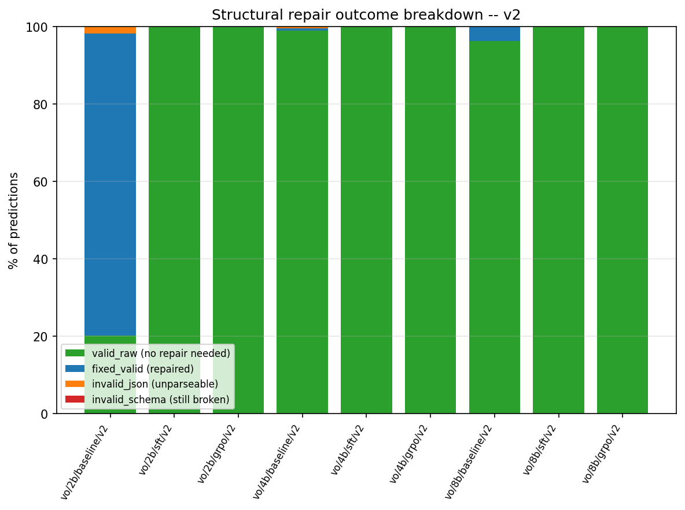

**The repair is load-bearing for exactly one run.** For eight of the nine it moves F1 by ≤ 0.008 — and at the
8B baseline it *hurts*. For `vo-baseline-2b-v2` it manufactures the entire result: 78.0% of records are
rescued, generating 378 true positives and 3,519 false positives out of unparseable text, and taking F1 micro
from 0.016 to 0.153.

Why 2B fails so badly: its raw outputs **degenerate and hit the 1,024-token cap**. Two modes, both visible in
`predictions.jsonl` — an infinite reasoning loop ("The rule is not violated by the truck, so the rule is not
violated by the truck, so …", 4,282 characters) and an unbounded list of near-duplicate boxes, both truncated
mid-JSON. The repair then closes the JSON (`json_truncation_repaired`, 64 records), reshapes flat box lists
(`box_flat_list_reshaped`, 1,083 records) and merges list-valued violations (`violation_list_merged`, **1,257
records = 42% of the split**). The merged result asserts rule_1 on 93.5% of images.

**Consequence for reporting:** `structural_json_validity_rate` in `metrics.json` is measured *after* repair, so
it reads 0.981 for a model whose real format compliance is **20.1%**. The honest number is
`repair_stats.csv::status:valid_raw:pct`, and it is the single biggest thing SFT fixes:

| raw format compliance (valid JSON + schema, before any repair) | 2B | 4B | 8B |
|---|---:|---:|---:|
| baseline | **20.11%** | 98.97% | 96.27% |
| SFT | 99.93% | 99.90% | 99.97% |
| GRPO | 99.87% | **100.00%** | 99.97% |

---

## 11. Honesty section: what these numbers do *not* mean

### 11.1 The 2B baseline row is a measurement of the repair script

See above. In any writeup, `vo-baseline-2b-v2` should be reported as *"20.1% of outputs were valid; after
structural repair, F1 = 0.153"* — or dropped from the headline. Its recall of 0.890 is not a detection result.

### 11.2 The zero-shot baselines' recall is bought entirely by over-flagging

Read `violation_pred_positive_rate` (0.59–0.94) before any baseline recall number. This is the same point the
dataset paper makes about its own zero-shot models, and it is why F1, balanced accuracy and rule_0 recall are
the honest summaries here, not recall.

### 11.3 The reasoning scores reward style, not only substance

After SFT the explanations collapse onto a small template set:

| run | items judged | unique sentences | most common sentence's share |
|---|---:|---:|---:|
| 4B baseline | 375 | 292 | 2.4% |
| 4B SFT | 230 | **82** | 16.1% |
| 4B GRPO | 304 | **88** | 14.8% |
| 8B SFT | 223 | 82 | 12.1% |

The ground truth itself is *less* templated than our output (201 unique references for 230 items). So the
BERTScore jump from 0.46 to 0.75 is substantially **learning the dataset's phrasing**, and average length
converging from 15–19 words to 11 (the reference length) is the same effect. `reward_reasoning` actively
encourages it: `0.6·cosine + 0.4·bigram-F1`, times a Gaussian length-match factor.

The judge inherits this. 60% of 4B SFT's judged items score a perfect **6/6**, which is precisely the red flag
`CLAUDE.md` warns about. The clearest case is rule_4, where the judge returns 6.00 on *every* item for four of
the nine runs — because the model emits essentially one sentence ("The worker on the left is in the blind spot
and operation radius of the excavator") against a similarly templated reference, on n = 4–12 items.
**`reasoning_llm_judge_total_rule_4 = 6.0` must not be presented as a perfect reasoning score.**

Also note `relevance` is near-saturated (1.68–1.95 of 2) *by construction*: our JSON format tells the judge
which rule the sentence belongs to, so the criterion the paper used to catch off-topic explanations cannot fire
the same way.

### 11.4 Reasoning and grounding are scored on different image populations per run

Every reasoning/grounding number is conditioned on that run's own true positives — 193 items for 2B SFT versus
286 for 2B GRPO. Comparing means across phases compares different image sets. Use the matched-subset table in
[§8](#8-reasoning-quality-text-similarity-and-the-llm-judge), and always print `scored_count`.

### 11.5 The rare rules have tiny denominators

rule_2, rule_3 and rule_4 have 25, 63 and 24 positives in the whole 3,004-image split. A per-rule F1 there
carries a 95% CI up to 0.33 wide, and macro-F1 averages four such numbers. Almost no per-rule SFT→GRPO
difference on the rare rules is significant. Per-rule CIDEr-D computed on n = 4 references carries no
information at all.

### 11.6 The SFT → GRPO delta contains an unmeasured merge artifact

SFT trains a LoRA adapter on a **4-bit** base and is evaluated as 4-bit-base + adapter. The merge then loads the
base in **16-bit**, merges, and saves; GRPO re-quantises that merged model to 4-bit. So the policy GRPO starts
from is not byte-equivalent to the SFT policy that was measured, and part of every SFT→GRPO delta is
quantisation round-trip drift rather than reinforcement learning. The magnitude is unknown and is very likely
small, but it is currently unmeasured. A three-job control experiment fixes that ([§13](#13-v3-plan-costed-and-prioritised), P0-2).

### 11.7 Two toolset caveats

- `delta_vo_v2.csv`'s win tally credits the baseline with 19–20% of metrics, largely because bare `recall` is
  registered as "higher is better" and shotgunning wins it. Don't quote the tally; read the headline table.
- `reasoning_text_similarity_clipscore_*` ranks the **baselines highest** at every tier (0.680 vs 0.668). It
  measures image–text alignment of a longer, more descriptive sentence, which is not the quantity we want. It
  is already demoted out of the headline; keep it out of any comparison.

---

## 12. Root-cause analysis

Nothing in v2 is broken. What follows is the ranked list of *why the numbers look the way they do*, with the
evidence for each.

### 12.1 Why macro-F1 does not move with GRPO — reward/metric mismatch (primary)

The reward is a per-image, rule-**pooled** F-beta with `violation_fbeta = 2.0` plus a single global
`violation_tn_constant`. Two consequences:

- Its implied operating point is **one global confidence threshold, p\* = 0.298, for all four rules.**
- For micro-F1 that is nearly optimal (adding a flag improves micro-F1 when its precision exceeds ≈ F1/2 ≈
  0.27, and GRPO's additions sit at 0.37), which is exactly why micro-F1 rose significantly.
- For macro-F1 it is wrong by a factor of ~2.5 on the rare rules, whose per-rule break-even is F1/2 ≈ 0.17
  (rule_3) and ≈ 0.12 (rule_4). Since the model's achievable rule_4 precision is 0.15–0.19, a global threshold
  of 0.298 makes every rule_4 flag EV-negative, so GRPO correctly suppressed them.

**Macro-F1 flatness is the intended behaviour of the reward we specified.** It is a specification issue, not a
training failure.

### 12.2 Why rare-rule recall halves — GRPO pool imbalance (co-primary)

SFT trains on `datasets/augmented`, where rule multiplicities 16/12/6 collapse the rule spread from 14.5:1 to
**1.26:1**. GRPO then trains on `datasets/grpo_pool`, built from *pre-augmentation* data:

| GRPO pool | rule_1 | rule_2 | rule_3 | rule_4 | safe | total |
|---|---:|---:|---:|---:|---:|---:|
| images | 677 | 59 | 109 | **46** | 866 | 1,732 |

That is **14.7 : 1** for rule_1 : rule_4. Over 108 steps × 32 unique images per update, a rule_4 image is seen
roughly 92 times (8 rollouts each) against rule_1's ~1,350. So GRPO both *devalues* the rare rules (§12.1) and
barely *sees* them. The pool composition is deliberate (pre-augmentation data avoids correlated reward groups),
but it silently discards the rule rebalancing SFT was given.

A second, smaller prior mismatch sits on top: the pool is **50% safe** while the test split is **86.3% safe**.
SFT, trained on a 67%-safe set, flags 13.3–14.8% of test images against a 13.68% true rate — essentially
calibrated. GRPO, trained at 50/50, flags 18.8–21.9%. The flag rate tracks the training prior.

### 12.3 Why GRPO stalls halfway — zero-variance groups and a tight clip

`frac_reward_zero_std` = 0.41–0.47 means nearly half of each update contributes no gradient, and `reward_std`
halves over the run. Reward plateaus at step ~40–70 of 108. Simultaneously `max_grad_norm = 0.3` binds on
14–19 of 21 logged steps while the KL anchor contributes 1.6e-4 to the loss. The run is throughput-starved and
gradient-capped at the same time; the second half of every GRPO job buys almost nothing.

### 12.4 Why 8B < 4B after fine-tuning — overfitting, not adapter capacity

Evidence, in order of strength:
1. The 8B **baseline** is the best of the three baselines (F1 0.2815 vs 4B's 0.2275, *p* < 0.001). The
   pretrained 8B model is genuinely stronger, so the loss happens during fine-tuning.
2. 8B SFT reaches its best eval_loss at **step 125 of 512** and drifts **+11.2%** by the end, versus +3.3% at
   2B and +3.9% at 4B. Train loss meanwhile falls to 0.035 (vs 2B's 0.063). Classic overfit, scaling with
   capacity.
3. 8B's final eval_loss (0.0606) is *worse* than 4B's (0.0582) — the only inversion in the table.
4. The LoRA-capacity confound is ruled out: 1.10 / 1.10 / 1.16% of parameters trained, verified at runtime.
5. 8B GRPO achieves the **highest training reward** (0.482 vs 4B's 0.469) and the **lower** test F1, i.e. it
   fits the training signal better and generalises worse.

Secondary, unmeasured: 4-bit NF4 quantisation error may grow with model width, and 8B is the only tier showing
GRPO transients (§10). Neither is tested.

### 12.5 Why absolute F1 is ~0.6 and not ~0.85 — no exposed confidence

The oracle-headroom and post-hoc-probe results in [§7](#7-per-rule-breakdown-and-what-grpo-actually-did) say
this directly: the correct flags are already being emitted, nothing cheap separates them from the wrong ones,
and the model exposes no confidence to threshold. This is the ceiling v3 has to attack, and it is not a
scale problem.

### 12.6 Why the 2B baseline collapses — degenerate decoding, no penalty

`repetition_penalty = 1.0` (disabled) and `max_new_tokens = 1024` at inference, in every phase. The zero-shot
2B model loops until truncation on 80% of images. This is a decoding choice, not a perception result, and it is
why the 2B baseline needs the repair script to produce any number at all.

### 12.7 Code and configuration issues found — full list

Searched: all nine run configs and manifests, the four reward functions, `metrics_violations.py`,
`metrics_llm_judge.py`, `evaluator.py`, `model_loader.py`, `merge_sft_adapter.py`, `inference.py`,
`results_lib.py`, `validate_rewards.py`, and every SLURM/Python log.

| # | severity | finding | status |
|---|---|---|---|
| 1 | **reporting** | `structural_json_validity_rate` is computed post-repair, so it reports 0.981 for a model with 20.1% raw compliance | real; fix by emitting a `_raw` variant |
| 2 | **config** | GRPO `max_grad_norm: 0.3` binds on 67–90% of steps and is the only active brake (`beta·KL` ≈ 1.6e-4) | real; try 1.0 |
| 3 | **config** | GRPO pool rule imbalance 14.7:1 while SFT sees 1.26:1 | real; §12.2 |
| 4 | **design** | one global `violation_tn_constant` sets one threshold for four rules with very different achievable precision | real; §12.1 |
| 5 | **method** | QLoRA merge round-trip: adapter trained against a 4-bit base is merged into a 16-bit base, then re-quantised for GRPO | real but unmeasured; control job proposed |
| 6 | **robustness** | `mask_truncated_completions: true` + a fully-masked sequence ⇒ logged `kl = NaN` (2 steps, 8B). Loss stayed finite | cosmetic now, latent risk |
| 7 | **fairness** | `repetition_penalty` disabled at inference lets the 2B baseline degenerate on 80% of images | real; §12.6 |
| 8 | **eval semantics** | identification TP uses *presence*; reward TP requires *substance*. Measured contentless assertions across all nine runs: **0**. | no impact |
| 9 | **provenance** | `run_config.json` records the pre-resolution `lora: {r: 16}`; the real per-tier rank is only in the training log | cosmetic; log line confirms 16/20/32 |
| 10 | **tooling** | `experiments/results_charts.py` called `cm.get_cmap(...)`, removed in matplotlib ≥ 3.9 — charts crashed on ARC and locally | **fixed in this pass** (version-safe `_cmap` helper); 120 charts now generate |
| 11 | **tooling** | `delta_vo_v2.csv` win tally is misleading for this task (bare `recall` counts as higher-is-better) | documented, §11.7 |
| 12 | **hygiene** | `git_is_dirty: true` in all nine manifests | commit before v3 so runs are reproducible from a hash |
| 13 | **stale docs** | `README.md`'s results table predates v1 and cites numbers from an old archive | pointer added to this file |

**No bug was found that invalidates any v2 number.** Items 1, 7 and 11 are *reporting* issues — the values are
correct, the labels are misleading. Items 2–5 are design choices with measurable costs. Item 10 is fixed.

---

## 13. v3 plan, costed and prioritised

### P0 — answer the open questions with **no new training** (9 jobs, ≈ 12 GPU-hours)

| # | experiment | why | cost |
|---|---|---|---|
| **P0-1** | Evaluate `checkpoints/qwen3vl-<tier>/vo-sft-<tier>-v2/**best**` at all three tiers | `best/` is already on disk (step 275 / 375 / **125**). Directly tests the overfitting hypothesis for 8B (§12.4). If 8B `best` beats 8B `final`, the fix is a shorter 8B budget, and that is a one-line config change. | 3 × (inference + eval) ≈ 4 h |
| **P0-2** | Evaluate `merged-vo-sft-<tier>-v2` with **no adapter** | Isolates RL from the merge/re-quantisation round trip (§11.6), and tells us whether the merge itself costs accuracy. Needs a check that `run_inference.py` accepts `--base_model_override` with no checkpoint. | 3 × ≈ 4 h |
| **P0-3** | Emit raw (pre-repair) structural metrics | Removes reporting issue #1 permanently. One extra call to `compute_structural_metrics` on the pre-repair file, keys suffixed `_raw`. | ~20 lines, no GPU |
| **P0-4** | Commit the tree and re-run `validate_rewards.py`, `pytest -k "not submitter_can_override_gres"` | `git_is_dirty: true` in all nine v2 manifests. | minutes |

P0-1 and P0-2 are the highest expected-value work in this whole list: they can resolve the two biggest open
questions (is 8B overtrained? how much of the GRPO gain is really RL?) for 12 GPU-hours and no retraining.

### P1 — config/code changes, then one full re-run (≈ 40 GPU-hours)

| # | change | from → to | rationale |
|---|---|---|---|
| **P1-1** | `configs/grpo.yaml::max_grad_norm` | `0.3` → **`1.0`** | Binds on 67–90% of steps; it is the only brake still doing anything. SFT already uses 1.0. Watch `kl` (target 0.01–0.10) and `reward/mean`. |
| **P1-2** | `configs/grpo.yaml::num_generations` | `8` → **`12`** | `frac_reward_zero_std` = 0.41–0.47. More rollouts per group ⇒ more groups with usable variance. Costs ~50% more generation time; GRPO is the long job, so budget 14 h at 8B. |
| **P1-3** | Rebalance the GRPO pool by rule | rule_1 : rule_4 = 14.7 : 1 → ≈ 3 : 1 | Cap rule_1-only images and keep every rare-rule image, holding safe at 50%. **Do not duplicate images** — near-duplicates create correlated reward groups, which is why the pool reads pre-augmentation data. Subsample instead. Directly targets §12.2. |
| **P1-4** | Per-rule operating point in `reward_violation_id` | pooled set-F2 → per-rule weighted F-beta | The principled fix for macro (§12.1). Weight rule *r*'s TP/FN contribution by `w_r ∝ prevalence_r^(−1/2)` (tempered inverse frequency: ≈ 1.0 / 3.4 / 2.5 / 3.8 for rules 1–4), which lowers the rare rules' effective threshold toward their achievable precision without making them free. **Re-run `scripts/validate_rewards.py --probe` before submitting** — it checks the break-even band (0.20, 0.50) and that no degenerate policy beats the honest one. |
| **P1-5** | 8B SFT budget | 512 steps → **256 (1 epoch)** *or* LR `1e-4` → `5e-5` at 8B only | Conditional on P0-1. Keep the 2B/4B budget unchanged so the tier comparison stays clean, and record the per-tier LR in `model_registry.yaml` as declared config, never as a hidden override. |
| **P1-6** | Uniform inference `repetition_penalty` | `1.0` → **`1.05`** for **all** phases | Stops the 2B baseline degenerating (§12.6) so the baseline measures the model, not the decoder. Must be applied to every phase or it becomes a new confound; SFT/GRPO don't repeat, so it costs them nothing. Re-runs all 9 inferences. |
| **P1-7** | Guard the NaN KL | — | Skip the KL log when the completion mask is empty. Cosmetic today, prevents a NaN loss if a whole batch truncates. |

Report **both** micro-F1 and F2 as primary going forward, with macro as a diagnostic — the reward is
recall-weighted by explicit design, so F2 is the metric it optimises and F1 is the metric the literature uses.

### P2 — the actual research step: give the model a confidence (≈ 20–60 GPU-hours)

Everything above moves an operating point along a curve we cannot see. §7 shows the curve is where the value
is: an oracle selector on what the models already emit scores F1 ≈ 0.86 against our 0.60, and no cheap
post-hoc feature separates right from wrong flags (all AUCs 0.44–0.59).

| option | how | cost | notes |
|---|---|---|---|
| **P2-a (recommended)** | At inference, capture `P(null)` vs `P({)` at each `rule_N_violation` position via `return_dict_in_generate=True, output_scores=True`, and store it per rule alongside the prediction. Then report **precision–recall curves and average precision**, and pick the threshold on *val*, not test. | ~60 lines in `models/inference.py` + eval support; re-run 9 inferences ≈ 20 h | Exact, free at generation time, and turns every table in this report from one point into a curve. It would also immediately show whether SFT or GRPO has the better *ranking* independent of threshold — the question we currently cannot answer. |
| **P2-b** | Self-consistency: sample k = 5 completions at T = 0.7 and use the vote fraction as confidence. | 5× inference ≈ 60 h, no training change | Needs no code beyond a sampling loop, and typically improves both precision and recall. More expensive, less exact. |
| **P2-c** | Add a `confidence` field to the output schema and reward it with a proper scoring rule (Brier) in GRPO. | schema + reward + full retrain | The "right" long-term answer; largest change; do it after P2-a shows the headroom is real. |

### P2 also worth doing

- **Reasoning diversity metric.** Report unique-sentence ratio / distinct-2 next to BERTScore and the judge, so
  template collapse (§11.3) is visible rather than rewarded silently.
- **Judge audit on a stratified sample.** 60% of items score 6/6; sample 40 non-templated cases and check them
  by hand before quoting judge means in a paper.
- **Human-correlation spot check.** The paper validated its judge at Spearman ρ = 0.83 against humans. Even 50
  hand-scored items would let us report a correlation and put the judge numbers on a much firmer footing.

### Does v2 need to be re-run before it can be presented?

**No.** Every v2 number in this document is correct as measured, the pipeline behaved as designed, and the
results are a clear, statistically significant improvement over both v1 and every model published on this
dataset. The P0 items are *controls* that strengthen the claims; P1/P2 are the next research increment. The
only thing that must change before presenting is the *wording* around the 2B baseline and the structural
validity rate (§11.1, §11.2) — both handled in this report.

---

## 14. Configuration of record

Everything below is read back from the nine runs' own `run_config.json` / `run_manifest.json`, not from the
YAML — this is what actually executed, at commit `4acb833`.

### SFT

| | value |
|---|---|
| base models | `unsloth/Qwen3-VL-{2B,4B,8B}-Instruct`, `load_in_4bit: true` |
| dataset | `datasets/augmented` — 8,198 rows (6,308 + rare-rule augmentation 16×/12×/6× for rules 4/2/3) |
| steps | 512 = ⌊8198/32⌋ × 2 epochs, `dataloader_drop_last: true` |
| LR / schedule | `1.0e-4`, `cosine`, `warmup_ratio 0.1`, `adamw_8bit`, `weight_decay 0.01`, `max_grad_norm 1.0` |
| LoRA | **r/α = 16/16 (2B), 20/20 (4B), 32/32 (8B)** via `model_registry.yaml::lora_by_tier`, dropout 0.05, `all-linear`, vision tower frozen |
| trained fraction | 23.7M/2.15B = **1.10%** · 49.2M/4.49B = **1.10%** · 102.7M/8.87B = **1.16%** |
| batch | per-device 32, grad-accum 1 |
| images | `image_min_pixels 200704`, `image_max_pixels 1204224` (1.2 MP cap), `max_seq_length 3072` |
| checkpointing | `early_stopping_patience: null`, `load_best_model_at_end: false`, handoff from **`final/`** |
| sampling | stratified rare-rule sampler on rules 2/3/4; `oversample_*_multiplier: 1` (no-op) |

### GRPO

| | value |
|---|---|
| base | `merged-vo-sft-<tier>-v2` (16-bit merge of the SFT adapter), loaded `load_in_4bit: true` |
| pool | `datasets/grpo_pool` — 1,732 images, 866/866 safe/violation; rule_1 677, rule_2 59, rule_3 109, rule_4 46 |
| steps | 108 = ⌊1732/32⌋ × 2 epochs |
| LR / schedule | **`1.0e-5`, `constant_with_warmup`**, `warmup_ratio 0.05`, `adamw_8bit`, **`max_grad_norm 0.3`** |
| GRPO | `num_generations 8`, `per_device_train_batch_size 16`, `steps_per_generation 4`, `gradient_accumulation_steps 16` ⇒ 32 unique images/update, 8 images per `generate()` |
| brakes | `beta 0.04` (KL to the merged reference via `disable_adapter()`), `scale_rewards "group"`, `loss_type "dapo"`, `mask_truncated_completions true` |
| lengths | `max_prompt_length 2304`, `max_completion_length 1024`, `max_seq_length 3600` |
| rewards | `reward_format` **0.05** · `reward_violation_id` **0.422** · `reward_violation_grounding` **0.317** · `reward_reasoning` **0.211** |
| reward constants | **`violation_tn_constant: 0.30`** · `violation_fbeta: 2.0` · `require_violation_substance: true` · `repetition_penalty: 1.0` (off) |
| implied operating point | **p\* = 0.298** (validator band 0.20–0.50) |

### Inference & evaluation

Greedy (`do_sample=False`, `temperature=0.0`), `max_new_tokens 1024`, `repetition_penalty 1.0`, batch 32,
`inference_max_seq_length 3200`, identical system+task prompt in all nine runs. Chain is always
inference → `preprocessing/structural_repair.py` → `experiments/run_evaluation.py --skip_spice --use_llm_judge`.

LLM judge: `meta-llama/Meta-Llama-3-8B-Instruct`, bf16, `num_beams 5`, `seed 20`, `max_new_tokens 64`,
`batch_size 1`, `fail_hard: false`, 12 few-shot blocks (5 from the paper verbatim + 7 authored), rubric sha256
`28297153fe9d4358…`, elapsed 147–288 s per evaluation, **`status: ok` and 0 unparsed replies in all 9 runs**.

### Wall-clock

| tier | baseline | SFT | merge | GRPO |
|---|---|---|---|---|
| 2B | 1:19:02 | 1:09:08 | 0:01:02 | 5:23:31 |
| 4B | 1:18:36 | 1:45:55 | 0:03:30 | 9:21:57 |
| 8B | 0:47:37 | 2:01:50 | 0:01:48 | 11:26:53 |

One infrastructure loss: the first 4B attempt (`48501344/45`) died at 1:15 with `NODE_FAIL` on `mgh5` — a
cluster node crash, not a code fault (the log ends mid-line at inference sample 48/94 with no traceback). All
its artifacts were deleted and the tier was resubmitted as `48521185–88`.

---

## 15. Reproducing this report

**On ARC** (login node, no GPU, pure file I/O):

```bash
cd $HOME/vlm-safety-reasoning
module load gcc/13.3.0 python/3.12.5 && source $HOME/envs/vlm_grpo/bin/activate
export PYTHONPATH="$HOME/vlm-safety-reasoning:$PYTHONPATH" \
       VLM_DATA_ROOT="$HOME/vlm-finetuning-project1" HF_HOME="$HOME/scratch/hf_cache"

python -m experiments.build_results_index --tasks violations_only --versions v2 --out $HOME/v2_dump/index_v2.json
python -m experiments.build_results_index --tasks violations_only               --out $HOME/v2_dump/index_all.json
```

`index_v2.json` carries `violation_per_image_outcomes_b64` (one byte per image: predicted rule mask in the high
nibble, ground truth in the low nibble), which is all the paired bootstrap needs — about 4 KB per run.

**Locally** (the bootstrap is too slow for a login node; use `--bootstrap 0` there):

```powershell
.\venv\Scripts\Activate.ps1
python -m experiments.compare_all --index results_index\v2_dump\index_v2.json `
       --out results_index\analysis_v2 --bootstrap 2000
```

That writes `master_wide.csv` (235 metric keys × 9 runs), `delta_vo_v2.csv`, `repair_stats.csv`,
`significance.csv` and 120 charts under `charts/`. The figures in this document are copied into
`figures_v2/` so they render on GitHub (`results_index/` is git-ignored).

Everything else in this report — the v1 reconstruction, the marginal analysis, the oracle headroom, the
matched-subset judge comparison, the raw-vs-repaired scoring, and the post-hoc confidence probe — is analysis
on top of the same two files plus the run dump (`results/inference/*/{predictions.jsonl,
repair_applied/,evaluation_results/}`, `logs/`, `provenance/`, `datasets_stats/`).

---

*Report generated 2026-09-16 from the 9 completed `violations_only` v2 runs at commit `4acb833`.*
